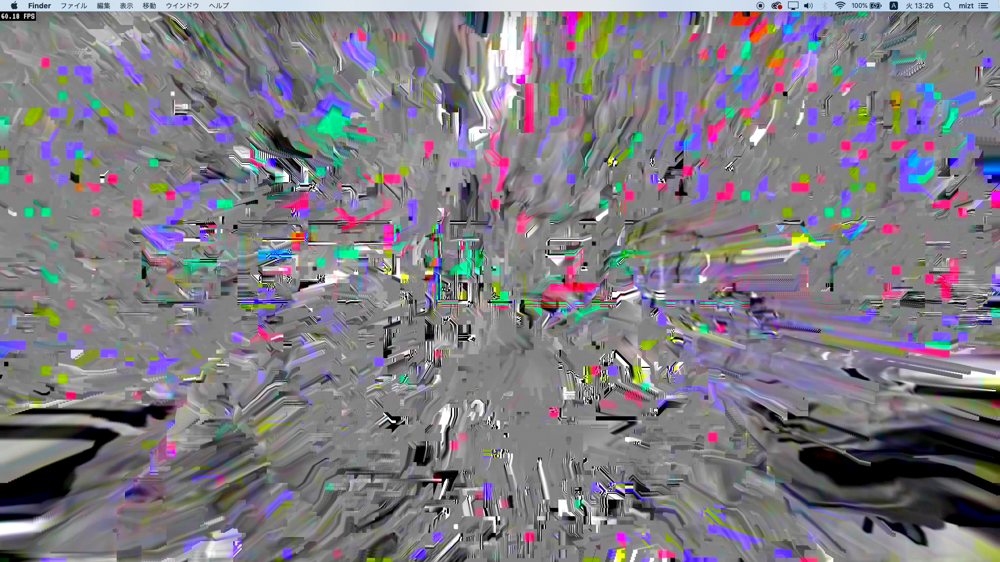
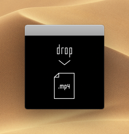

# bbbc

Tokisato Miztsuru 2018

### Requirements

macOS Mojave or later.

### Download

[https://github.com/mizt/bbbc/archive/0.2.1.zip](https://github.com/mizt/bbbc/archive/0.2.1.zip)

### Encode

Open `bbbc-enc.app` and drop `.mp4` in the window.    
(Automatically fits to 1280x720 resolution)   

Wait until the progress bar reaches 100%.  

The Data is exported to `~/Movies/bbbc/`. 

### Settings

Write random values to `~/Movies/bbbc/settings.json`.

	$node bbbc-settings.js

Or manually.
	
	{
		"headers": [
			"/headers/0.bin",
			"/headers/1.bin",
			"/headers/2.bin"
		],
		"keys": {
			"q": "/packets/q.bin",
			"w": "/packets/w.bin",
			"e": "/packets/e.bin",
			"r": "/packets/r.bin",
			"t": "/packets/t.bin",
			"y": "/packets/y.bin"
		}
	}

### Play

Open `bbbc.app`.    
Try typing.

`space bar` key to hide the fps.  
`delete` key erase screen.

### Dependencies

[theora](https://www.theora.org/faq/#14)
